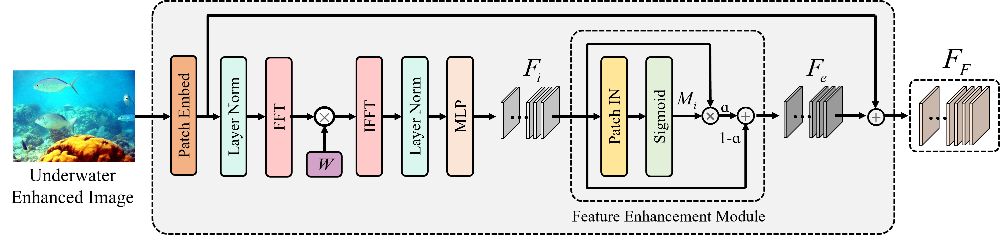

# UEIQI

## Deep No-Reference Quality Assessment for Underwater Enhanced Images

📚[This Paper is waiting publication.](https://ieeexplore.ieee.org) Accepted by IEEE Transactions on Multimedia.

### Architecture of UEIQI

<picture>
  
</picture>

### Fog Density Estimation Module

<picture>
  
</picture>

### Testing prediction code of UEIQI
NULL.

### Citation

🌟 If you find our work helpful, please leave us a star and cite our paper.

BibTeX
```
Waiting for publication.
```

GB/T 7714
```
Waiting for publication.
```

